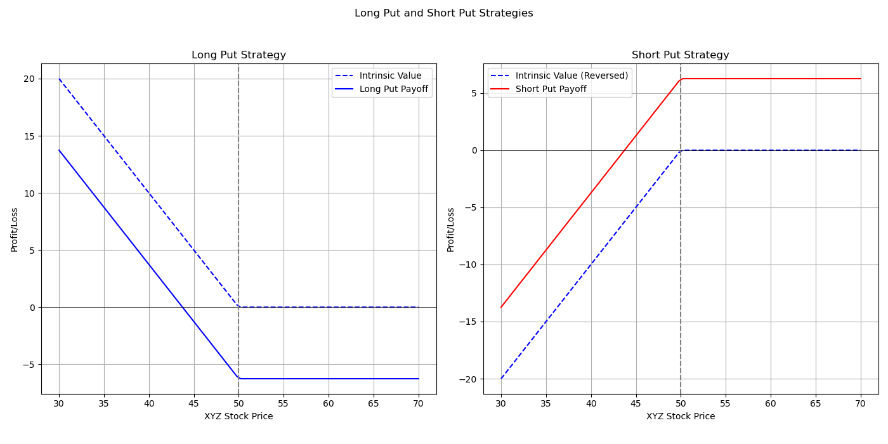

# Quantitative Finance Models

This repository contains Python implementations of various quantitative finance models.

## Models Included
1. **Randomness of Assets**: 
   - Simulates asset price movements using stochastic processes.

2. **Binomial Tree**:
   - Models option pricing using a recombining tree structure.

3. **Black-Scholes Model**:
   - Analyzes option pricing through the Black-Scholes formula.


# CFA

This folder contains Python scripts for visualizing different option trading strategies using Matplotlib. We include scripts for both call and put strategies, each with subplots illustrating the payoffs for long and short positions.

## Files Included

- `callpayoff.py`: Script for visualizing long and short call strategies.
- `putpayoff.py`: Script for visualizing long and short put strategies.

## Visualizations

### Call Strategies

The graph below shows the intrinsic value and net payoff for both long and short call strategies.

#### Long Call and Short Call


### Put Strategies

The graph below shows the intrinsic value and net payoff for both long and short put strategies.

#### Long Put and Short Put



## How to Use

1. Make sure you have Python installed and install `matplotlib` if needed:
    ```bash
    pip install matplotlib
    ```
2. Run the scripts and follow the on-screen prompts to input your desired values.

### Example Execution

To generate the call strategy graphs, execute:
```bash
python callpayoff.py


## Getting Started
### Prerequisites
- Python 3.x
- Install dependencies with:
```bash
pip install -r requirements.txt
